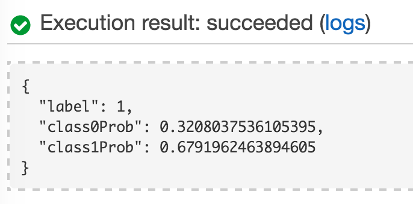

# H2O generated POJO model WebApp Example

This example shows a generated Java POJO being called using a REST API from a JavaScript Web application.

The application classifies domain names as legitimate or malicious. Malicious domains distribute malware on networks and services of 
unsuspecting hosts. They are generated using domain generation algorithms (DGA) rather than being hardcoded to defeat security systems. 
This example builds a classifier for domains based on their linguistic features.
 
Legitimate domains:

* google.com
* zen-cart.nl
* fedoraforum.org
 
Malicious domains:

* zyxgifnjobqhzptuodmzov.ru
* c3p4j7zdxexg1f2tuzk117wyzn.com
* batdtrbtrikw.ru

The "Building a Smarter Application" presentation given at H2O World 2015 references this repo.

* <https://github.com/h2oai/h2o-world-2015-training/tree/master/tutorials/building-a-smarter-application>


## Pieces at work

### Processes

(Front-end)   

1.  Web browser

(Back-end)   

1.  Jetty servlet container

> Note:  Not to be confused with the H2O embedded web port (default 54321) which is also powered by Jetty.


## Files

(Data)
* legit-dga_domains.csv (Available at <http://datadrivensecurity.info/blog/data/2014/10/legit-dga_domains.csv.zip>)
* src/main/resources/words.txt (Available at <https://raw.githubusercontent.com/dwyl/english-words/master/words.txt>)

(H2O Model)

* h2o-model.py

(Deployment package for AWS Lambda)

* lib/h2o-genmodel.jar (downloaded)
* lib/aws-lambda-java-core-1.0.0.jar
* lib/jython-standalone-2.7.0.jar
* src/main/java/Classify.java
* src/main/java/MaliciousDomainModel.java (generated)
* src/main/resources/pymodule.py

(Offline)

* build.gradle

(Front-end)

* src/main/webapp/index.html
* src/main/webapp/app.js

(Back-end)


## Steps to run

##### Step 1: Create the gradle wrapper to get a stable version of gradle.

```
$ gradle wrapper
```

##### Step 2: Install the latest stable build of the h2o Python module if you don't have it yet.

<http://www.h2o.ai/download/h2o/python>

##### Step 3: Build the project.

```
$ ./gradlew build
```

##### Step 4: Upload .zip Deployment Package to AWS Lambda

###### 4.1 Sign in to the AWS Management Console and open the AWS Lambda console.
###### 4.2 Click "Get Started Now", or if you have created functions already, click "Create a Lambda function"
###### 4.3 Click "Skip" on the bottom right.
###### 4.4 Configure Lambda function.


4.4.1 In the Name text field, type "malicious-domain-classifier".

4.4.2 In the Runtime field, select "Java 8".

4.4.3 Click the Upload button and select app-malicious-domains/build/distributions/app-malicious-domains.zip

4.4.4 In the Handler field, type "Classify::myHandler"

4.4.5 In the Role field, select "\*Basic execution role". In the new tab click "Allow" on the bottom right. 

4.4.6 Click "Next" on the bottom right, which opens the Review page.

4.4.7 Click "Create function" on the bottom right. If this step fails, click "Previous" and redo step 4.4.3 by 
uploading app-malicious-domains.zip to S3, selecting "Upload a .ZIP from Amazon S3", and providing the S3 link URL.
 
###### 4.5. Test Lambda function.

4.5.1 Click "Actions" and select "Configure test event" near the top left of the page.


4.5.2 Enter json format the domain to be classified. For example {"domain":"plzdonthackmethx"} and click "Save and test".
Execution results near the bottom of the page should display "succeeded" and give a json response. If an error message 
shows that the task timed out, Click "Advanced settings" and increase the Timeout field.



##### Step 5: Create API endpoint for Lambda function.
###### 4.1. Click the "API endpoints" tab and then "Add API endpoint".
###### 4.2. Configure API endpoint


4.2.1 Select API Gateway for the API endpoint type field.

4.2.2 Select "POST" for the Method field. 

4.2.3 Type "prod" for the Deployment stage field.
 
4.2.4 Select "Open" for the Security field.

4.2.5 Click "Submit".

###### 4.3. Test API endpoint

4.3.1 Copy the API endpoint URL that now appears in the API endpoint tab.
 
4.3.2 Make the following POST request with curl using the API endpoint URL from the previous step.
```
$ curl -X POST -d "{\"domain\":\"plzdonthackmethx\"}" <api_endpoint_url>
```
Verify json output with label and class probabilities.
 
###### 4.3. Enable CORS 


Open the API Gateway console in the AWS Management Console.

Select "LambdaMicroservice".

Select "/malicious-domain-classifier" on the left sidebar.

Click "Enable CORS".


Click "Enable CORS and replace existing CORS headers" on the bottom right.

Click "Yes, replace existing values" on the pop-up window.

Click "Deploy API" near the top left.

Select "prod" in Deployment stage field and click "Deploy".
 
##### Step 4: Deploy the .war file in a Jetty servlet container.

```
$ ./gradlew jettyRunWar -x generateModels
```

(If you don't include the -x generateModels above, you will build the models and deployment package again, which is time consuming.)

##### Step 5: Visit the webapp in a browser.

<http://localhost:8080/>


## Underneath the hood

Make a prediction with curl and get a JSON response.

```
$ curl "localhost:8080/predict?loan_amnt=10000&term=36+months&emp_length=5&home_ownership=RENT&annual_inc=60000&verification_status=verified&purpose=debt_consolidation&addr_state=FL&dti=3&delinq_2yrs=0&revol_util=35&total_acc=4&longest_credit_length=10"
{
  "labelIndex" : 0,
  "label" : "0",
  "classProbabilities" : [
    0.8581645524025798,
    0.14183544759742012
  ],

  "interestRate" : 12.079950220424134
}
```

Notes:

* classProbabilities[1] is .1418.  This is the probability of a bad loan.
* The threshold is the max-F1 calculated for the model, in this case approximately .20.
* A label of '1' means the loan is predicted bad.
* A label of '0' means the loan is not predicted bad.
* If the loan is not predicted bad, then use the interest rate prediction to suggest an offered rate to the loan applicant.


```
$ curl "localhost:8080/predict?loan_amnt=10000&term=36+months&emp_length=5&home_ownership=RENT&annual_inc=60000&verification_status=blahblah&purpose=debt_consolidation&addr_state=FL&dti=3&delinq_2yrs=0&revol_util=35&total_acc=4&longest_credit_length=10"
[... HTTP error response simplified below ...]
Unknown categorical level (verification_status,blahblah)
```


## Performance

1.  Set VERBOSE to false in src/main/java/org/gradle/PredictServlet.java

1.  ./gradlew jettyRunWar -x war

1.  Run apachebench as shown here:

```
$ ab -k -c 8 -n 10000 "localhost:8080/predict?loan_amnt=10000&term=36+months&emp_length=5&home_ownership=RENT&annual_inc=60000&verification_status=VERIFIED+-+income&purpose=debt_consolidation&addr_state=FL&dti=3&delinq_2yrs=0&revol_util=35&total_acc=4&longest_credit_length=10"
This is ApacheBench, Version 2.3 <$Revision: 655654 $>
Copyright 1996 Adam Twiss, Zeus Technology Ltd, http://www.zeustech.net/
Licensed to The Apache Software Foundation, http://www.apache.org/

Benchmarking localhost (be patient)
Completed 1000 requests
Completed 2000 requests
Completed 3000 requests
Completed 4000 requests
Completed 5000 requests
Completed 6000 requests
Completed 7000 requests
Completed 8000 requests
Completed 9000 requests
Completed 10000 requests
Finished 10000 requests


Server Software:        Jetty(6.1.25)
Server Hostname:        localhost
Server Port:            8080

Document Path:          /predict?loan_amnt=10000&term=36+months&emp_length=5&home_ownership=RENT&annual_inc=60000&verification_status=VERIFIED+-+income&purpose=debt_consolidation&addr_state=FL&dti=3&delinq_2yrs=0&revol_util=35&total_acc=4&longest_credit_length=10
Document Length:        160 bytes

Concurrency Level:      8
Time taken for tests:   3.151 seconds
Complete requests:      10000
Failed requests:        0
Write errors:           0
Keep-Alive requests:    10000
Total transferred:      2470247 bytes
HTML transferred:       1600160 bytes
Requests per second:    3173.23 [#/sec] (mean)
Time per request:       2.521 [ms] (mean)
Time per request:       0.315 [ms] (mean, across all concurrent requests)
Transfer rate:          765.49 [Kbytes/sec] received

Connection Times (ms)
              min  mean[+/-sd] median   max
Connect:        0    0   0.0      0       0
Processing:     0    3  10.5      0      52
Waiting:        0    3  10.5      0      52
Total:          0    3  10.5      0      52

Percentage of the requests served within a certain time (ms)
  50%      0
  66%      0
  75%      0
  80%      0
  90%      0
  95%      1
  98%     51
  99%     51
 100%     52 (longest request)
```

On a Macbook Pro with a 2.7 GHz Intel Core i7 this run gives:

* throughput of 3173 requests / second
* latency of 2.52 milliseconds / request


## References

The gradle distribution shows how to do basic war and jetty plugin operations. 

1. <https://services.gradle.org/distributions/gradle-2.7-all.zip>
2. unzip gradle-2.7-all
3. cd gradle-2.7/samples/webApplication/customized

AWS Lambda documentation 

<http://docs.aws.amazon.com/lambda/latest/dg/create-deployment-pkg-zip-java.html>


