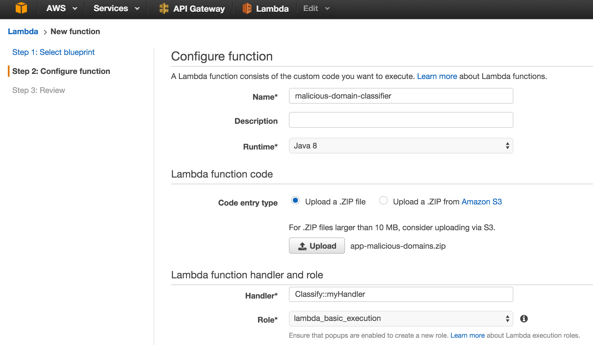
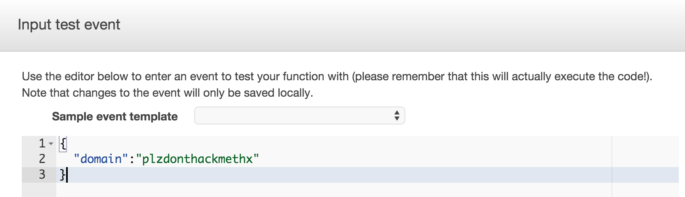
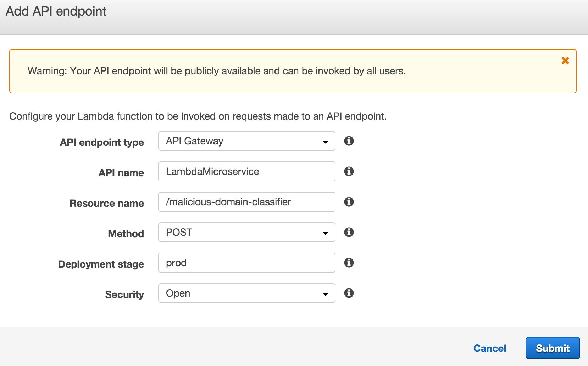
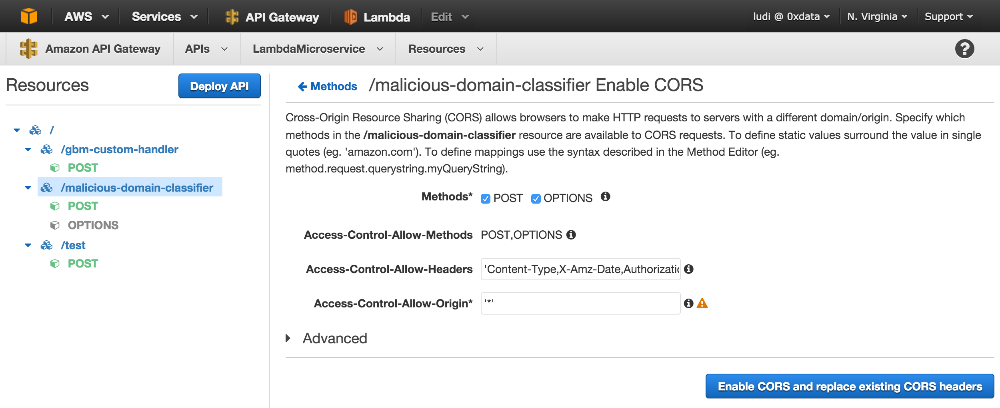

#Jython feature munging and H2O generated POJO model running on AWS Lambda WebApp

This example shows how to call Jython code and a generated POJO from AWS Lambda via a REST endpoint. The front-end
is a web browser. The back-end is powered by AWS Lambda, which is an Amazon service that automatically manages compute resources
for code that is responsive to events. It simplifies the process of scaling microservices, eliminating the need to provision or 
 manage servers. 


<br>

The application classifies domain names as legitimate or malicious. Malicious domains earn their label by engaging 
in malicious activity, such as botnets, phishing, and malware hosting. In order to defeat security systems, 
attackers use domain names that are generated by algorithms. To detect domains which may be malicious, the app builds
 a model based on linguistic features that distinguish regular domains from those that are algorithmically generated.
 
|  Legitimate domains |      Malicious domains     |
|:--------|:-------------|
|h2o.ai |  zyxgifnjobqhzptuodmzov.ru |
| zen-cart.nl |    c3p4j7zdxexg1f2tuzk117wyzn.com   |
| fedoraforum.org | batdtrbtrikw.ru |
 

The ["Make Data Products" presentation][] given at the Silicon Valley Big Data Science meetup on March 17, 2016 references this repo.
["Make Data Products" presentation]: https://github.com/h2oai/h2o-tutorials/tree/master/tutorials/aws-lambda-app

## Files

| Data   | Offline                    | Front-end  | Back-end  |
|----------|------------------------|---|---|
| legit-dga_domains.csv | build.gradle |  src/main/webapp/index.html |  lib/h2o-genmodel.jar (downloaded) |
| src/main/resources/words.txt | h2o-model.py|src/main/webapp/app.js   |  lib/aws-lambda-java-core-1.0.0.jar |
|          |                        |   | lib/jython-standalone-2.7.0.jar  |
|          |                        |   | src/main/java/Classify.java  |
|          |                        |   | src/main/java/MaliciousDomainModel.java (generated)  |
|          |                        |   | src/main/resources/pymodule.py  |


## Steps to run

### Step 1: Create the gradle wrapper to get a stable version of gradle.

```
$ gradle wrapper
```

### Step 2: Install the latest stable build of the h2o Python module if you don't have it already.

<http://www.h2o.ai/download/h2o/python>

### Step 3: Build project

```
$ ./gradlew build
```

### Step 4: Create AWS Lambda function

#### 4.1 Sign in to the AWS Management Console and open the AWS Lambda console.
#### 4.2 Click "Get Started Now", or if you have created functions already, click "Create a Lambda function".
#### 4.3 Click "Skip" on the bottom right.
#### 4.4 Configure Lambda function.



##### In the Name text field, type "malicious-domain-classifier".

##### In the Runtime field, select "Java 8".

##### Click the Upload button and select app-malicious-domains/build/distributions/app-malicious-domains.zip in the file selector.

##### In the Handler field, type "Classify::myHandler".

##### In the Role field, select "\*Basic execution role". In the new tab click "Allow" on the bottom right. 

##### Click "Next" on the bottom right, which opens the Review page.

##### Click "Create function" on the bottom right. If this step fails, click "Previous" then provide the S3 link URL at "Upload a .ZIP from Amazon S3" after uploading app-malicious-domains.zip to S3,.

#### 4.5 Test Lambda function (Optional)

##### Click "Actions" and select "Configure test event" near the top left of the page.



##### Enter JSON format of the domain name to be classified, for example {"domain":"plzdonthackmethx"}, and click "Save and test". Execution results near the bottom of the page should display "succeeded" and give a JSON response. If an error message shows that the task timed out, Click "Advanced settings" to increase the Timeout field.

### Step 5: Create API endpoint for Lambda function.
#### 5.1 Click the "API endpoints" tab and then "Add API endpoint".
#### 5.2 Configure API endpoint



##### Select API Gateway for the API endpoint type field.

##### Select "POST" for the Method field. 

##### Type "prod" for the Deployment stage field.
 
##### Select "Open" for the Security field.

##### Click "Submit".

##### Write down the API endpoint URL that now appears in the API endpoint tab. It will be needed for step 6.1.

#### 5.3 Enable CORS 

##### Open the API Gateway console in the AWS Management Console.

##### Select "LambdaMicroservice".

##### Select "/malicious-domain-classifier" on the left sidebar.

##### Click "Enable CORS".



##### Click "Enable CORS and replace existing CORS headers" on the bottom right.

##### Click "Yes, replace existing values" on the pop-up window.

##### Click "Deploy API" near the top left.

##### Select "prod" in Deployment stage field and click "Deploy".

### Step 6: Deploy the .war file

#### 6.1 Open app-malicious-domains/main/webapp/app.js and change line 20 to the API endpoint URL.  

#### 6.2 Run the following command:

```
$ ./gradlew jettyRunWar -x generateModel
```

(If you don't include the -x generateModel above, you will build the models and deployment package again, which is time consuming.)

### Step 7: Visit the webapp in a browser.

<http://localhost:8080/>


## Underneath the hood

### H2O Model: Logistic Regression with regularization
#### Features

#### * string length
#### * Shannon entropy
#### * proportion of vowels
#### * proportion of substrings >=2 chars that are English words
```
Confusion Matrix (Act/Pred) for max f1 @ threshold = 0.498768729215: 
       0      1      Error    Rate
-----  -----  -----  -------  ---------------
0      15797  407    0.0251   (407.0/16204.0)
1      402    9987   0.0387   (402.0/10389.0)
Total  16199  10394  0.0304   (809.0/26593.0)

```
#### Model Prediction via API endpoint
 
##### Make the following POST request with curl using the API endpoint URL.

```
$ curl -X POST -d "{\"domain\":\"plzdonthackmethx\"}" <api_endpoint_url>
```

##### JSON response with label and class probabilities.

```
{
  "label": 1,
  "class0Prob": 0.32080375361054,
  "class1Prob": 0.67919624638946
}
```
 
* A label of 1 means the domains is predicted malicious.
* A label of 0 means the loan is predicted legitimate (not malicious).
* class1Prob is 0.679. This is the probability a domain is malicious.
* The threshold is the max-F1 calculated for the model, in this case approximately 0.5.


## Performance

1.  Set VERBOSE to false in src/main/java/org/gradle/PredictServlet.java

1.  ./gradlew jettyRunWar -x war

1.  Run apachebench as shown here:

```
$ ab -k -c 8 -n 10000 "localhost:8080/predict?loan_amnt=10000&term=36+months&emp_length=5&home_ownership=RENT&annual_inc=60000&verification_status=VERIFIED+-+income&purpose=debt_consolidation&addr_state=FL&dti=3&delinq_2yrs=0&revol_util=35&total_acc=4&longest_credit_length=10"
This is ApacheBench, Version 2.3 <$Revision: 655654 $>
Copyright 1996 Adam Twiss, Zeus Technology Ltd, http://www.zeustech.net/
Licensed to The Apache Software Foundation, http://www.apache.org/

Benchmarking localhost (be patient)
Completed 1000 requests
Completed 2000 requests
Completed 3000 requests
Completed 4000 requests
Completed 5000 requests
Completed 6000 requests
Completed 7000 requests
Completed 8000 requests
Completed 9000 requests
Completed 10000 requests
Finished 10000 requests


Server Software:        Jetty(6.1.25)
Server Hostname:        localhost
Server Port:            8080

Document Path:          /predict?loan_amnt=10000&term=36+months&emp_length=5&home_ownership=RENT&annual_inc=60000&verification_status=VERIFIED+-+income&purpose=debt_consolidation&addr_state=FL&dti=3&delinq_2yrs=0&revol_util=35&total_acc=4&longest_credit_length=10
Document Length:        160 bytes

Concurrency Level:      8
Time taken for tests:   3.151 seconds
Complete requests:      10000
Failed requests:        0
Write errors:           0
Keep-Alive requests:    10000
Total transferred:      2470247 bytes
HTML transferred:       1600160 bytes
Requests per second:    3173.23 [#/sec] (mean)
Time per request:       2.521 [ms] (mean)
Time per request:       0.315 [ms] (mean, across all concurrent requests)
Transfer rate:          765.49 [Kbytes/sec] received

Connection Times (ms)
              min  mean[+/-sd] median   max
Connect:        0    0   0.0      0       0
Processing:     0    3  10.5      0      52
Waiting:        0    3  10.5      0      52
Total:          0    3  10.5      0      52

Percentage of the requests served within a certain time (ms)
  50%      0
  66%      0
  75%      0
  80%      0
  90%      0
  95%      1
  98%     51
  99%     51
 100%     52 (longest request)
```

On a Macbook Pro with a 2.7 GHz Intel Core i7 this run gives:

* throughput of 3173 requests / second
* latency of 2.52 milliseconds / request


## References
###Gradle
The gradle distribution shows how to do basic war and jetty plugin operations. 

1. <https://services.gradle.org/distributions/gradle-2.7-all.zip>
2. unzip gradle-2.7-all
3. cd gradle-2.7/samples/webApplication/customized

###AWS Lambda 

<http://docs.aws.amazon.com/lambda/latest/dg/create-deployment-pkg-zip-java.html>

###Data Sources
* legit-dga_domains.csv (Available at <http://datadrivensecurity.info/blog/data/2014/10/legit-dga_domains.csv.zip>)
* src/main/resources/words.txt (Available at <https://raw.githubusercontent.com/dwyl/english-words/master/words.txt>)

