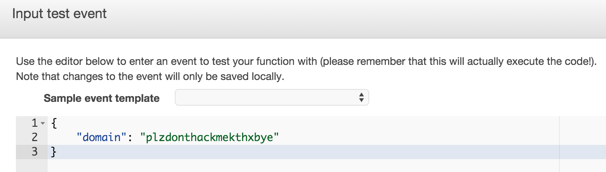

#Building a Machine Learning Application with AWS Lambda

This example builds a machine learning application using AWS Lambda, which is an Amazon service that automatically manages compute resources
for code that is request-driven. It simplifies the process of scaling microservices, eliminating the need to provision or 
 manage servers. The front-end of the application is a web browser, while the backend is a Lambda function, with components that include a function handler, 
 Jython code for feature munging, and an H2O model POJO. The front-end and back-end communicate via a REST endpoint. 


<br>

The application classifies domain names as legitimate or malicious. Malicious domains earn their label by engaging 
in malicious activity, such as botnets, phishing, and malware hosting. In order to defeat security systems, 
attackers use domain names that are generated by algorithms. To detect domains which may be malicious, the app builds
 a model based on linguistic features that distinguish regular domains from those that are algorithmically generated.
 
|  Legitimate domains |      Malicious domains     |
|:--------|:-------------|
|h2o |  zyxgifnjobqhzptuodmzov |
| zen-cart |    c3p4j7zdxexg1f2tuzk117wyzn   |
| fedoraforum | batdtrbtrikw |
 

The ["Make Data Products" presentation][] given at the Silicon Valley Big Data Science meetup on March 17, 2016 references this repo.
["Make Data Products" presentation]: https://github.com/h2oai/h2o-tutorials/tree/master/tutorials/aws-lambda-app

## Files

| Data   | Offline                    | Front-end  | Back-end  |
|----------|------------------------|---|---|
| legit-dga_domains.csv | build.gradle |  src/main/webapp/index.html |  lib/h2o-genmodel.jar (downloaded) |
| src/main/resources/words.txt | h2o-model.py|src/main/webapp/app.js   |  lib/aws-lambda-java-core-1.0.0.jar |
|          |                        |   | lib/jython-standalone-2.7.0.jar  |
|          |                        |   | src/main/java/Classify.java  |
|          |                        |   | src/main/java/MaliciousDomainModel.java (generated)  |
|          |                        |   | src/main/resources/pymodule.py  |


## Steps to run

### Step 1: Create the gradle wrapper to get a stable version of gradle.

```
$ gradle wrapper
```

### Step 2: Install the latest stable build of the h2o Python module if you don't have it already.

<http://www.h2o.ai/download/h2o/python>

### Step 3: Build project

```
$ ./gradlew build
```

### Step 4: Create AWS Lambda function

#### 4.1 Sign in to the AWS Management Console and open the AWS Lambda console.
#### 4.2 Click "Get Started Now", or if you have created functions already, click "Create a Lambda function".
#### 4.3 Click "Skip" on the bottom right.
#### 4.4 Configure Lambda function.


##### In the Name text field, type "malicious-domain-classifier".

##### In the Runtime field, select "Java 8".

##### Click the Upload button and select app-malicious-domains/build/distributions/app-malicious-domains.zip in the file selector.

##### In the Handler field, type "Classify::myHandler".

##### In the Role field, select "\*Basic execution role". In the new tab click "Allow" on the bottom right. 

##### Click "Next" on the bottom right, which opens the Review page.

##### Click "Create function" on the bottom right. If this step fails, click "Previous" then provide the S3 link URL at "Upload a .ZIP from Amazon S3" after uploading app-malicious-domains.zip to S3,.

#### 4.5 Test Lambda function (Optional)

##### Click "Actions" and select "Configure test event" near the top left of the page.



##### Enter JSON format of the domain name to be classified, for example {"domain":"plzdonthackmekthxbye"}, and click "Save and test". Execution results near the bottom of the page should display "succeeded" and give a JSON response. If an error message shows that the task timed out, click "Advanced settings" to increase the Timeout field.

### Step 5: Create API endpoint for Lambda function.
#### 5.1 Click the "API endpoints" tab and then "Add API endpoint".
#### 5.2 Configure API endpoint


##### Select API Gateway for the API endpoint type field.

##### Select "POST" for the Method field. 

##### Type "prod" for the Deployment stage field.
 
##### Select "Open" for the Security field.

##### Click "Submit".

##### Write down the API endpoint URL that now appears in the API endpoint tab. It will be needed for step 6.1.

#### 5.3 Enable CORS 

##### Open the API Gateway console in the AWS Management Console.

##### Select "LambdaMicroservice".

##### Select "/malicious-domain-classifier" on the left sidebar.

##### Click "Enable CORS".


##### Click "Enable CORS and replace existing CORS headers" on the bottom right.

##### Click "Yes, replace existing values" on the pop-up window.

##### Click "Deploy API" near the top left.

##### Select "prod" in Deployment stage field and click "Deploy".

### Step 6: Deploy the .war file

#### 6.1 Open app-malicious-domains/src/main/webapp/app.js and change line 26 to the API endpoint URL.  

#### 6.2 Run the following command:

```
$ ./gradlew jettyRunWar -x generateModel
```

(If you don't include the -x generateModel above, you will build the models and deployment package again, which is time consuming.)

### Step 7: Visit the webapp in a browser.

<http://localhost:8080/>


## Underneath the hood

### H2O Model: Logistic Regression with regularization
#### Features

#### * string length
#### * Shannon entropy
#### * proportion of vowels
#### * count of substrings that are English words
```
Confusion Matrix (Act/Pred) for max f1 @ threshold = 0.493541945983: 
       0      1      Error    Rate
-----  -----  -----  -------  ---------------
0      15889  315    0.0194   (315.0/16204.0)
1      346    10043  0.0333   (346.0/10389.0)
Total  16235  10358  0.0249   (661.0/26593.0)

```
#### Model Prediction via API endpoint
 
##### Make the following POST request with curl using the API endpoint URL.

```
$ curl -X POST -d "{\"domain\":\"plzdonthackmekthxbye\"}" <api_endpoint_url>
```

##### JSON response with label and class probabilities.

```
{
  "label": 1,
  "class0Prob": 0.002564083122440164,
  "class1Prob": 0.9974359168775598,
  "intercept": -14.94132841574946,
  "length": 29.841565204329598,
  "entropy": 11.178560649883826,
  "proVowels": -1.7679609134401084,
  "numWords": -18.347249579636706
}
```
 
* A label of 1 means the domains is predicted malicious.
* A label of 0 means the loan is predicted legitimate (not malicious).
* class1Prob is 0.997. This is the probability a domain is malicious.
* The threshold, approximately 0.5, is chosen to maximize the F1 score. 

## Troubleshooting

### Error uploading .zip file (Step 4.4)
Check if the function already exists and, if not, try again. For slower internet connections, try uploading the .zip file with a S3 link in the Code tab.

### Timeout when testing Lambda function (Step 4.5)
In the AWS Lambda console, click the Configuration tab. Click Advanced settings and increase the timeout field.

### Gateway timeout (504 error) or "(Invalid input)" when using webapp (Step 7)
This is due to Lambda's cold start. Keep attempting domain names and after no more than a minute, the webapp should be responsive.

## Performance

Performance was tested with JMeter on a MacBook Pro with 2.5 GHz Intel Core i7 on wireless internet connection over the office WAN.
 Before testing, a warm-up cycle of 100 loops was run. Times are in milliseconds. The body data of the POST request was {"domain":"plzdonthackmekthxbye"}.  

| Memory (MB) | Threads | Loops | Samples | Average | Median | 90% | 95% | 99%  | Min | Max   | Error % | Throughput (calls/sec) |
|-------------|---------|-------|---------|---------|--------|-----|-----|------|-----|-------|---------|------------------------|
| 512         | 1       | 10000 | 10000   | 113     | 102    | 118 | 138 | 426  | 85  | 2137  | 0       | 8.4                    |
| 512         | 10      | 1000  | 10000   | 170     | 102    | 148 | 182 | 334  | 85  | 30330 | 0.18    | 44                     |
| 512         | 100     | 100   | 10000   | 392     | 149    | 643 | 943 | 1738 | 85  | 30307 | 0.43    | 168                    |


## References
###Gradle
The gradle distribution shows how to do basic war and jetty plugin operations. 

1. <https://services.gradle.org/distributions/gradle-2.7-all.zip>
2. unzip gradle-2.7-all
3. cd gradle-2.7/samples/webApplication/customized

###AWS Lambda 

<http://docs.aws.amazon.com/lambda/latest/dg/create-deployment-pkg-zip-java.html>

###Data Sources
* legit-dga_domains.csv (Available at <http://datadrivensecurity.info/blog/data/2014/10/legit-dga_domains.csv.zip>)
* src/main/resources/words.txt (Available at <https://raw.githubusercontent.com/dwyl/english-words/master/words.txt>)

